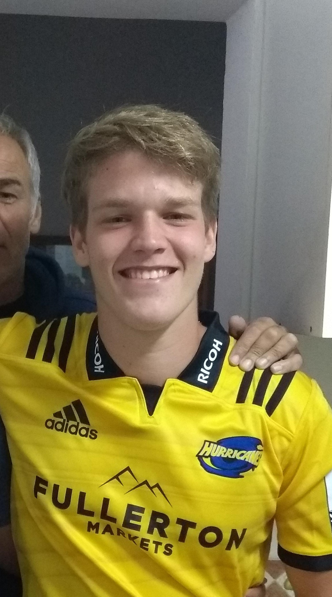

(no tengo fotos en las que salga bien y se me vea la cara de cerca. No es la mejor pero es lo que consegui)

## Cristobal Szkutnik

  Legajo: 171.603-7

  Hola! Como supongo ya se habran dado cuenta ese es mi repositorio asi que aca va una pequeña presentacion mia.  
  Tengo 19 años y entre el año pasado a la facultad. Antes que anda, y ante la pregunta del profesor, si tengo mascotas.  
  Es un cocker spaniel dorado de 10 años. Son divinos de cachorros pero insoportables tambien, tenganlo en cuenta por si  
  algun dia quieren uno, estan avisados. Sobre mi, me interesa cualquier cosa que tenga que ver con la tecnologia en  
  general, desde programar o andar personalizando Linux hasta que se me corrompa hasta jugar juegos, que es una de mis  
  actividades principales en mi tiempo libre, aunque tambien juego al rugby. En cuanto a programacion, tengo un poco de  
  experiencia en lo que es JavaScript y NodeJS. Igualmente esta experiencia no pasa de desarrollo recreativo, pero es  
  el lenguaje que mas ganas le meti hasta ahora. Tambien tengo cierto conocimiento en C++ y Python. Tengo un interes por  
  interiorizarme en Java o C# en un futuro no muy lejano.

  Tengo un proyecto que hice en mi tiempo libre subido a una repo de GitHub, y pienso ir agregando mas conforme pase el tiempo.  
  Si estan aburridos y quieren echarle un ojo, son bienvenidos. Capaz hasta encuentran algun bug y me ayudan a resolverlo.
  
  Si, me costo hacer que se vea bien. Me llevo 6 commits.

  Les dejo un FAQ ahora.
  
  Q. A tus papas les gusta la historia? Como vos te llamas Cristobal y tu hermano Napoleon...  
  A. No, simplemente les gustaban los nombres.
  
  Q. De donde es tu apellido?  
  A. Polonia
